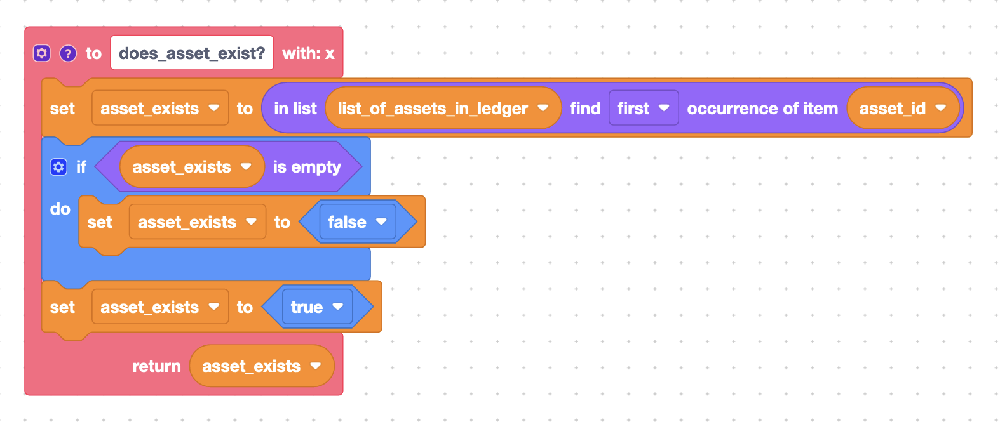

# Building Smart Contracts on a Hyperledger Fabric (HLF) network using Blockly

The Hyperledger Fabric network is an enterprise-level, permissioned blockchain protocol with privacy controls. Business logic, also known as "smart contracts" can be written in any of the following languages: NodeJS, Java, and Go. Non-developers are currently unable to define execution logic due to lack of software development knowledge and skills. This talk highlights how Blockly can be used to author smart contracts through its familiar drag-n-drop interface to bridge the knowledge gap for non-developers to easily create logic to match their specific use cases.

## Approach

* Build custom blocks to represent common methods in a contract on the HLF network e.g. `AssetExists`, `CreateAsset`, `ReadAsset`.
* Expose blocks relevant to the specific target groups using custom Workspace configurations pre-populated on the backend.
* Limit the code produced on the client by generators to non-sensitive code only by replacing potentially sensitive operations with placeholders. These placeholders are then replaced with appropriate code values on the backend subject to approval based on existing network policy.


## Sample Smart Contract Method and Proposed Blockly Equivalent

### Building Custom Blocks

NodeJS
```
...
// AssetExists returns true when asset with given ID exists in world state.
    async AssetExists(ctx, id) {
        const assetJSON = await ctx.stub.getState(id);
        return assetJSON && assetJSON.length > 0;
    }
...
``` 

Blockly


### Using Custom Workspaces

Each organization in the Hyperledger Fabric network has a custom workspace with blocks specific to the peers they will be working with. To illustrate;

* **WaZoBia Org** is a fictitious organization on an HLF network that deals with providing intervention for _farmers_, as a result they have access to blocks related to _fertilizers_, _seeds_, _farmer funds_ in their workspace. 
* A second organization, **FunmiBaniWete Org** deals with _students_, and has blocks related to _scholarships_, _student-locations_, _year-of-study_ e.t.c in their own workspace.
* A third organization, **OgaAtTheTop Org**, has access to multiple audiences which includes _farmers_ and _students_, and so they see all the blocks from the workspaces above.

### Generating Non-sensitive code

This is tricky!